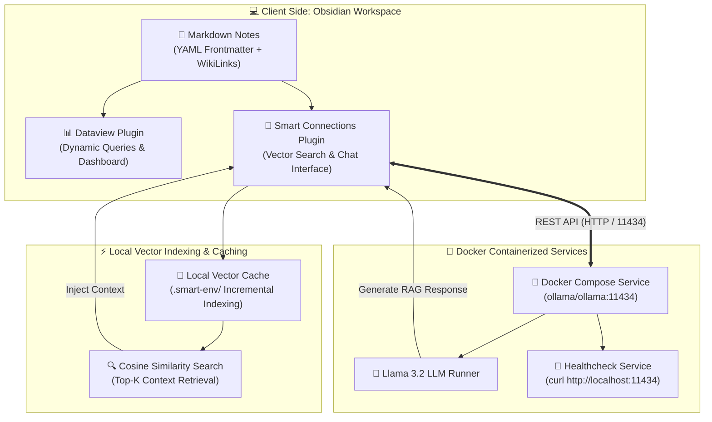
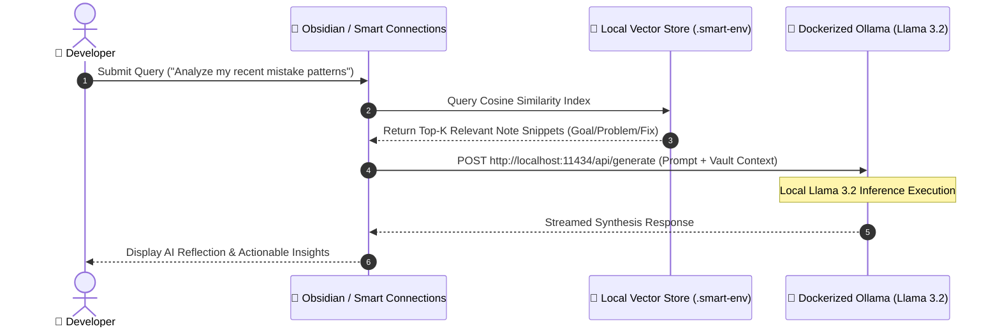

# 🧠 AI-Powered Personal Knowledge Base (Obsidian + Local Ollama RAG)

[](https://www.docker.com/)
[](https://ollama.com/)
[](https://meta.com)
[](https://obsidian.md/)
[]()
[]()

An enterprise-grade, localized **Personal Knowledge Management (PKM)** system built with **Obsidian** and a local **Ollama** LLM runner (`llama3.2`). It implements a complete offline **Retrieval-Augmented Generation (RAG)** pipeline allowing a local AI assistant to query, interlink, summarize, and reflect upon your local markdown notes with zero data leakage.

---

## 📐 System Architecture & Data Flow

Below is the complete architectural layout demonstrating how local notes, plugins, Docker container services, and semantic vector indexing communicate seamlessly:



---

## 🔄 RAG Retrieval Sequence Diagram

The diagram below details the sequence of events during a local RAG query execution:



---

## 📁 Repository & Vault Hierarchy

The vault contains **44 highly interlinked markdown notes** organized across 6 mandatory domains, governed by a strict metadata schema:

```
obsidian-ollama-rag/
├── 01-Learning/                # Technical concepts (DSA, Big O, Algorithms) [9 Notes]
├── 02-Career-Interview/        # Interview prep & behavioral STAR framework [5 Notes]
├── 03-Projects/                # Project tracking & architectural decisions [5 Notes]
├── 04-Content/                 # Book summaries, tech talks, & articles [4 Notes]
├── 05-Ideas/                   # Fleeting thoughts & feature concepts [5 Notes]
├── 06-Mistakes/                # Structured error logs (Goal / Problem / Fix) [9 Notes]
├── deliverables/               # Formal submission deliverables
│   ├── ai_interaction_log.md   # Log of 5 mandatory AI interactions
│   └── ai_reflection.md        # Technical reflection (>300 words)
├── .obsidian/                  # Obsidian configuration & community plugins
│   └── plugins/smart-connections/data.json  # Preconfigured Ollama connection
├── .env.example                # Documented environment variables
├── Dashboard.md                # Central hub with 3 dynamic Dataview queries
├── docker-compose.yml          # Container orchestration for Ollama & Llama 3.2
└── README.md                   # System documentation & setup guide
```

---

## 🏷️ Note Metadata & Linking Specification

Every note in the vault strictly adheres to standard YAML frontmatter tags and wiki-style interlinking:

```yaml
---
tags: [dsa, algorithm, interview]
---
# Binary Search Tree

In computer science, a [[Binary Search]] algorithm operates on sorted data structures...
```

### 🛠️ Structured Mistake Schema (`06-Mistakes/`)
Each note in `06-Mistakes/` follows a standardized 3-part diagnostic layout to enhance RAG retrieval precision:

```markdown
---
tags: [mistake, react, memory-leak]
---
# Memory Leak

### Goal
Prevent memory leaks when handling WebSocket event listeners in React.

### Problem
Failing to unmount event listeners in `useEffect` caused listener accumulation.

### Fix
Return a clean-up callback inside `useEffect` calling `removeEventListener()`.
```

---

## 📊 Dataview Dashboard Overview

The root [`Dashboard.md`](Dashboard.md) functions as a real-time, queryable hub using Obsidian Dataview code blocks:

| Query Type | Dataview Logic | Purpose |
| :--- | :--- | :--- |
| **Recent Mistakes** | ``dataview TABLE file.mtime AS "Last updated", tags FROM #mistake SORT file.mtime DESC`` | Tracks newly logged technical errors |
| **DSA Knowledge** | ``dataview LIST FROM #dsa SORT file.name ASC`` | Alphabetical index of core algorithm notes |
| **Global Recents** | ``dataview TABLE file.mtime AS "Modified", tags FROM "" SORT file.mtime DESC LIMIT 10`` | Top 10 most recently modified notes across vault |

---

## 🚀 Quick Start Guide

### 1. Prerequisites
- **Docker & Docker Compose** installed and running.
- **Obsidian Desktop** installed.
- **Hardware Requirement**: At least 8GB RAM available for local LLM inference.

### 2. Start the Local LLM Service
Run the background container service:
```bash
docker-compose up -d
```
The entrypoint script automatically initializes `ollama serve` and downloads `llama3.2`. Verify the status:
```bash
curl http://localhost:11434
# Output: "Ollama is running"
```

### 3. Open Vault & Enable Plugins
1. Open Obsidian and select **"Open folder as vault"**.
2. Select the repository root folder (`obsidian-ollama-rag`).
3. Navigate to **Settings > Community Plugins** and ensure Safe Mode is OFF.
4. Enable **Dataview** and **Smart Connections**.

### 4. Trigger Vector Indexing
- Open the Obsidian Command Palette (`Ctrl + P` or `Cmd + P`).
- Type `Smart Connections: Force re-index` and run it.
- Smart Connections will generate vector embeddings locally and store them in `.smart-env/`.

---

## 💡 Engineering Highlights & Key Observations

- **Local Data Privacy**: Zero data leaves your machine. All embeddings and LLM prompts remain inside local memory and Docker container network boundaries.
- **Incremental Indexing**: Smart Connections tracks file hashes inside `.smart-env/`, re-embedding only modified files rather than re-processing the entire vault.
- **Diagnostic Graph View**: Obsidian's Knowledge Graph visualization acts as an active diagnostic tool—identifying isolated "orphan" notes that require deeper technical interlinking.

---

## 🛠️ Technology Stack

| Tool | Role |
| :--- | :--- |
| **Obsidian** | Local-first Markdown editor & knowledge graph interface |
| **Smart Connections** | Semantic vector search — generates & stores note embeddings in `.smart-env/` |
| **Ollama (Llama 3.2)** | Local LLM inference engine — serves REST API on port 11434 |
| **Docker Compose** | Containerizes Ollama for reproducible, one-command setup |
| **Dataview** | Queries vault notes as a live database using YAML frontmatter |

---

## 🤔 Why This Approach?

**Local over Cloud:** Cloud LLM APIs require private data to leave the machine, introduce per-token costs at scale, and depend on network availability. For personal or proprietary knowledge bases, a fully local stack eliminates all three constraints.

**Smart Connections over a custom pipeline:** Building a custom embedding + retrieval pipeline would require managing a vector database, embedding model, chunking logic, and prompt construction separately. Smart Connections handles all of that natively inside Obsidian — reducing the engineering surface while keeping the pipeline transparent and configurable.

**Docker Compose for Ollama:** Makes the entire AI backend reproducible with a single command. The entrypoint script auto-pulls the model, and the healthcheck ensures readiness before any client connects.

---

## ⚠️ Current Limitations

- **Hardware requirement:** Minimum 8GB RAM needed to run Llama 3.2 comfortably. Inference on CPU-only machines is slower than cloud-hosted alternatives.
- **Interface coupling:** The system is tightly integrated with Obsidian — desktop-only, not accessible as an API, and limited to Markdown input format.
- **Chunking strategy:** Smart Connections splits notes by paragraph, which can cut context mid-thought on longer notes, reducing retrieval precision for complex queries.

---

## 🔭 Future Scope

- **Standalone Python RAG service:** Decouple from Obsidian and rebuild as a REST API using [LlamaIndex](https://www.llamaindex.ai/) or [LangChain](https://www.langchain.com/) with a dedicated vector database (pgvector or Qdrant) — enabling multi-user support and programmatic access.
- **Multi-format ingestion:** Extend beyond Markdown to support PDFs, HTML, and plain text documents.
- **Improved chunking:** Implement a sliding sentence-window strategy with configurable overlap for higher retrieval precision on long documents.
- **CI/CD validation:** GitHub Actions pipeline to automatically validate YAML frontmatter syntax and WikiLink integrity on every commit.

---

## 📂 Deliverables
- Log of 5 mandatory AI prompts & responses: [`deliverables/ai_interaction_log.md`](deliverables/ai_interaction_log.md)
- Deep-dive technical reflection: [`deliverables/ai_reflection.md`](deliverables/ai_reflection.md)
